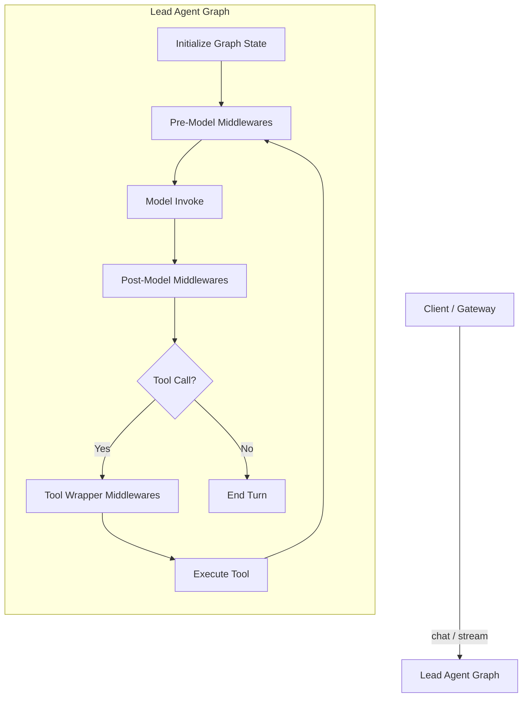
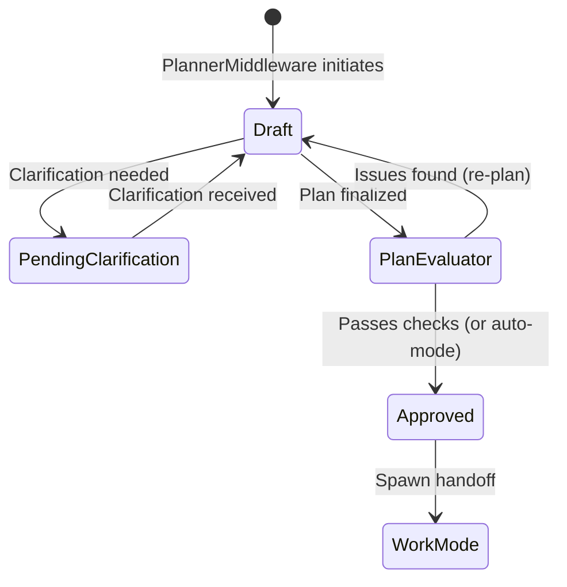
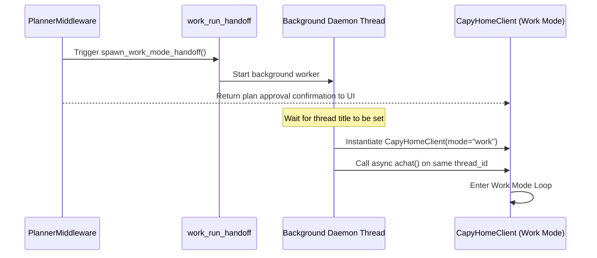

# Lead Agent and Harness Architecture: In-Depth Analysis

This document provides a comprehensive code analysis of the `lead_agent` flow and its harness within the CapyHome system. It details the initialization process, the topological middleware registry, the lifecycle of planning and execution modes, the daemon-based handoff mechanism, and the verification/testing framework.

---

## 1. Architectural Overview & Execution Model

The CapyHome system employs a stateful, thread-based architecture built on top of LangGraph. All client interactions on a specific thread share a single, persistent state space (`ThreadState`), which is persisted via a LangGraph checkpointer.



### Key Execution Characteristics
* **State Continuity**: Both **Plan Mode** and **Work Mode** execute sequentially on the same `thread_id`. They share the same message history and configuration settings.
* **Middleware Interception**: The system wraps LLM invocations and tool calls with a chain of custom middleware handlers, executing them in a strict topological order.
* **Harness Control**: The execution behavior can be dynamically changed from a full agentic pipeline to a minimal plumbing mode using a harness-level kill switch.

---

## 2. The Middleware Pipeline Registry

The core capabilities of the Lead Agent (from sandbox isolation to trace logging) are implemented as LangGraph `AgentMiddleware` components. The factory `make_lead_agent` (found in `backend/src/agents/lead_agent/agent.py`) dynamically builds this registry.

### Topological Ordering and Registry Definition
The middleware chain is built via `_build_middleware_registry`, which constructs a Directed Acyclic Graph (DAG) based on explicit `before` and `after` ordering constraints. The resolved execution sequence includes 15 distinct middleware stages:

| Order | Middleware | Source File | Key Responsibility |
|---|---|---|---|
| 1 | **ThreadDataMiddleware** | `thread_data.py` | Initializes thread-isolated workspaces on disk (`/user-data/{workspace,uploads,outputs}`). |
| 2 | **UploadsMiddleware** | `uploads.py` | Tracks newly uploaded files and injects them as human messages into the conversation. |
| 3 | **SandboxMiddleware** | `sandbox/middleware.py` | Configures and acquires the sandbox instance (local/docker) and registers `sandbox_id`. |
| 4 | **DanglingToolCallMiddleware** | `dangling_tool_call.py` | Repairs/cleans up tool calls that were interrupted or left in an inconsistent state. |
| 5 | **WorkModeMiddleware** | `work_mode_middleware.py` | Manages the ReAct execution loop, diffs todo statuses, and directs model tasks. |
| 6 | **PlanExecutionGateMiddleware** | `plan_execution_gate_middleware.py` | Prevents mutating tool execution when the plan is still in `draft` or awaiting clarifications. |
| 7 | **PermissionMiddleware** | `permission.py` | Enforces the security policy (`allow`, `deny`, `ask`) for tool execution. |
| 8 | **ToolDisclosureMiddleware** | `tool_disclosure.py` | Logs active tools or restricts visibility based on phase gates. |
| 9 | **HooksMiddleware** | `hooks.py` | Executes user-defined scripts/commands at specific hook locations. |
| 10 | **SummarizationMiddleware** | `summarization.py` | Compasses message history when approaching context limits, preserving vital context. |
| 11 | **SkillDisclosureMiddleware** | `skill_disclosure.py` | Injects system prompt content with relevant, dynamically activated skill definitions. |
| 12 | **PlannerMiddleware** | `planner_middleware.py` | Orchestrates complexity categorization, plan drafting, and todo generation. |
| 13 | **PlanEvaluatorMiddleware** | `plan_evaluator_middleware.py` | Performs a fast, secondary LLM sanity check on newly generated plan structures. |
| 14 | **EvaluatorMiddleware** | `evaluator_middleware.py` | Verifies final agent responses, checks artifact integrity, and critiques outputs. |
| 15 | **ExecutionTraceMiddleware** | `execution_trace_middleware.py` | Persists trace trajectories and streams event records to the UI in real time. |

---

## 3. Harness-Level Kill Switch

To allow instant fail-safes and debugging, the harness includes a global toggle (`HarnessConfig.enabled`) that strips the active middleware stack down to its bare essentials.

```mermaid
graph TD
    subgraph Harness Enabled = True
        FullStack[All 15 Middlewares Run]
    end
    subgraph Harness Enabled = False [Kill Switch Triggered]
        MinStack[Minimal Plumbing Stack Only:<br>1. ThreadDataMiddleware<br>2. SandboxMiddleware<br>3. DanglingToolCallMiddleware<br>4. ClarificationMiddleware]
    end
```

### The Minimal Plumbing Subset
When `harness.enabled` is set to `False`, the agent operates strictly within:
1. **ThreadDataMiddleware**: Keeps directories initialized.
2. **SandboxMiddleware**: Maintains file path sandboxing.
3. **DanglingToolCallMiddleware**: Safeguards tool states.
4. **ClarificationMiddleware**: Processes user clarifications.

This disables all planning, execution gates, evaluation checks, and tracing features, returning the agent to a simple, direct chat loop.

### Dynamic Runtime Sync
* **HTTP Endpoint**: The control plane exposes `PUT /api/harness/config` to toggle `enabled`.
* **Sidecar Persistence**: Flipped values are written to `harness_runtime.json` next to the main `config.yaml`.
* **Zero-Restart Convergence**: The LangGraph server checks the file's `mtime` on every invocation via `get_harness_config()`. If the sidecar is newer, the server invalidates its cached agent and builds a new middleware chain matching the new mode without requiring a process restart.

---

## 4. Plan Mode, Gates, and DAGs

When `configurable.is_plan_mode = True`, the agent operates in **Plan Mode** to break down complex tasks before executing them.



### PlannerMiddleware & JSON-Structured Plans
`PlannerMiddleware` acts as the entry point for planning. It analyzes the user request and generates a plan structured in the following format:
```json
{
  "plan_id": "plan_unique_id",
  "title": "Build a CLI Tool",
  "summary": "This plan covers directory listing, code generation, and test validation.",
  "status": "draft",
  "complexity_tier": "complex",
  "domain": "generic",
  "clarification_pending": false,
  "clarification_question": null
}
```

### Todo DAG Generation
Along with the plan, the planner creates a Todo Directed Acyclic Graph (DAG) under the `todo_graph` state parameter. This graph maps tasks and their dependencies:
```json
{
  "nodes": [
    {
      "id": "todo_1",
      "content": "Initialize python repository",
      "status": "pending",
      "depends_on": []
    },
    {
      "id": "todo_2",
      "content": "Write core CLI logic",
      "status": "pending",
      "depends_on": ["todo_1"]
    }
  ],
  "ready_ids": ["todo_1"],
  "updated_at": "2026-05-21T14:06:18Z"
}
```

### PlanExecutionGateMiddleware
This middleware safeguards execution while the plan is in `draft` state or awaiting clarification:
* **Allowed in Plan Mode**: Read-only tools (`ls`, `read_file`, `web_search`) and planning tools (`write_todos`, `ask_user_for_clarification`) are permitted.
* **Mutations Blocked**: Bash commands containing modification tokens (`rm`, `mv`, `tee`, `git commit`, `mkdir`, etc.) or custom write tools are intercepted and blocked.
* **Clarification Intercepts**: If `clarification_pending` is true, all tool calls except `ask_user_for_clarification` are blocked with an error instructing the agent to resolve the clarification first.

---

## 5. The Handoff Mechanism

Once a plan is finalized and transitions from `draft` to `approved` (either via manual UI approval or through `auto_mode=True`), the system initiates a handoff to execute the plan.



### Analysis of `spawn_work_mode_handoff`
The handoff logic (defined in `backend/src/agents/middlewares/work_run_handoff.py`) executes as follows:
1. **Daemon Spawning**: A background daemon thread is started using Python's `threading.Thread(target=..., daemon=True)`. This unblocks the foreground plan-approval turn immediately, allowing the UI to return a success state to the user.
2. **Title Synchronization**: The daemon waits for the thread's title to be generated (monitored via `TitleMiddleware`). This ensures the thread is fully registered in the workspace before work execution begins.
3. **In-Memory Client Invocation**: The background thread instantiates a new `CapyHomeClient` configured with:
   * `mode="work"`
   * `plan_behavior="work_interactive"`
   * Same `thread_id` and checkpointer context.
4. **Execution Initiation**: It asynchronously runs `achat()` on the client, feeding it an initial instruction (e.g., "Proceed with executing the approved plan.") to kick off the Work Mode loop.

---

## 6. The Work Mode Loop

Once in Work Mode, the agent is driven by `WorkModeMiddleware` (`backend/src/agents/middlewares/work_mode_middleware.py`) to execute tasks sequentially.

```mermaid
graph TD
    Start[Enter Work Mode Turn] --> FetchDAG[Read Todo DAG]
    FetchDAG --> DiffState[Diff Done/Pending Todos]
    DiffState --> NextReady{Next Ready Todo?}
    NextReady -->|None| Finish[Complete Plan & Stop]
    NextReady -->|Found| Inject[Inject Ephemeral Instructions]
    Inject --> LLM[Model Selects Action/Tool]
    LLM --> Exec[Execute Tool]
    Exec --> Validate{Check Result}
    Validate -->|Pass| Update[Mark Completed via write_todos]
    Update --> FetchDAG
    Validate -->|Blocked / Complex| Replan{Should Re-plan?}
    Replan -->|Yes (Cap = 2)| GoPlan[Switch back to Plan Mode]
    Replan -->|No| Fail[Mark Failed / Raise Alert]
```

### Loop Iteration and Instructions
On each model invocation turn, the middleware:
1. **Analyzes the DAG**: Identifies the set of todos whose dependencies are satisfied (present in `ready_ids`).
2. **Injects Instructions**: Injects an ephemeral `SystemMessage` containing the active task details, guiding the agent's attention to that specific step (e.g., `"[work_mode] Your current task is: Write core CLI logic. Focus only on this step."`).
3. **Executes ReAct**: The LLM calls tools, observes outputs, and updates the task status to `completed` using the `write_todos` tool once successful.

### Self-Adaptation and Re-Planning
If the agent encounters blockages, critical failures, or realizes the plan's complexity requires structural changes:
* **Escalation**: It can request re-planning.
* **Transition Back**: The middleware updates the plan's status back to `draft` and switches the runtime context `mode` to `"plan"`.
* **Loop Safety**: To prevent infinite ping-pong loops between planning and execution, the system caps re-planning transitions to a maximum of **2 attempts** per run.

---

## 7. Verification, Testing & Evals

The system includes a two-tier verification layer to ensure safety and prevent regression: runtime checks on final outputs, and automated trajectory replay benchmarking.

### EvaluatorMiddleware
Before completing a run, the `EvaluatorMiddleware` performs checks on terminal responses:
1. **Rule-Based Artifact Checks**:
   * Verification of `/mnt/user-data/workspace/plan.md` existence.
   * Verification of a versioned, timestamped plan trace file under `/mnt/user-data/workspace/plans/plan-*.md`.
   * Gathers failures and injects feedback as a `HumanMessage` to prompt correction if artifacts are missing.
2. **LLM Critiques**:
   * Evaluates the final response using a secondary evaluator prompt.
   * Returns a parsed response (e.g., `VERDICT: PASS` or `VERDICT: FAIL` with a `CRITIQUE`).
   * Allows up to a configured `max_attempts` for the agent to refine its response based on the critique.

### Trajectory Replay & Benchmark Suite
For integration testing, the system provides a replay runner in `backend/tests/evals/replay_runner.py`:
* **Trajectory Loading**: Reads JSONL logs recording the exact sequence of events from past agent executions.
* **Assertion Engine**: Compares the execution trajectory against test fixtures (`phase_a_normal_run.json`, `phase_b_replay_fixture.json`, etc.) to assert the presence of `required_events` and the absence of `forbidden_events`.
* **Regression Testing**: Manifests like `phase_c_benchmark_manifest.json` aggregate multiple test fixtures. The runner calculates a `pass_rate` and compares it to a `baseline_pass_rate`. If the regression exceeds the configured threshold, the suite fails.

---

## 8. Traceability and Event Streaming

To power real-time frontend monitoring, the `ExecutionTraceMiddleware` converts internal transitions into a standardized, streamable event schema.

### Wire Event Schema
Every trace entry conforms to the `ExecutionTraceEvent` TypedDict structure:
```typescript
interface ExecutionTraceEvent {
  id: string;                      // Format: "run_id:seq"
  schema: "v1";
  run_id: string;
  turn_id: string | null;
  stage: "lead" | "planner" | "evaluator" | "subagent" | "harness";
  event_type: string;              // e.g., "run_started", "tool_call_start"
  timestamp: number;               // Epoch seconds
  seq: number;                     // Sequence counter
  status: "info" | "running" | "completed" | "warning" | "failed";
  payload: Record<string, any>;    // Auto-truncated to 4000 characters
  token_usage?: {
    input_tokens: number;
    output_tokens: number;
    total_tokens: number;
  };
  thinking?: {
    source: "raw" | "summary";
    content: string;
  };
}
```

### Event Streaming & SSE
* **Real-time Writing**: Events are emitted using the LangGraph stream writer (`get_stream_writer()`) under the `trace_event.v1` channel.
* **Payload Truncation**: To prevent clogging the communication channel with massive terminal outputs or files, payloads larger than 4000 characters are truncated into a simple summary block before sending.
* **Decoupled Logging**: Trajectory event generation runs in a separate thread so it never blocks the primary agent execution loop.
