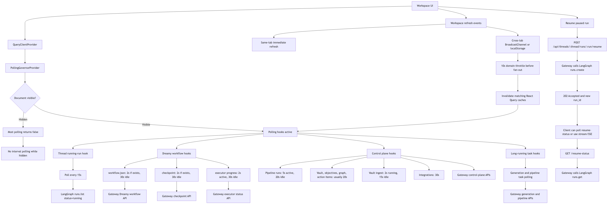
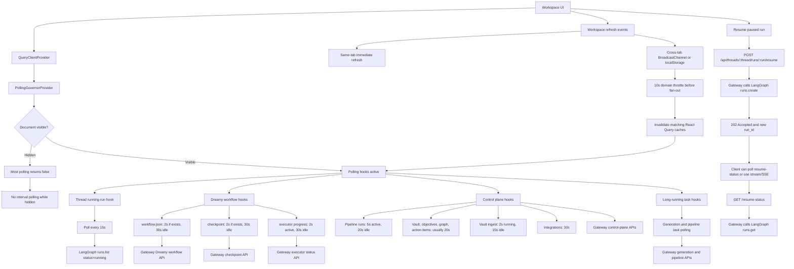

# Frontend Polling And Resume Fix

This note documents the current polling setup between the workspace UI, Gateway backend, and LangGraph after the frontend polling review fixes.

## Flow Diagram

Mermaid source is stored in [`polling-setup.mmd`](./polling-setup.mmd).

## Current Behavior

| Layer | Responsibility |
|---|---|
| `PollingGovernorProvider` | Tracks whether the workspace tab is visible. |
| `useDocumentVisible()` | Gives polling hooks a React state signal so intervals resume after a hidden tab becomes visible. |
| Polling hooks | Return an interval when visible and `false` when hidden. |
| React Query | Owns interval timers, cache state, and query invalidation. |
| Workspace refresh system | Publishes same-tab and cross-tab refresh events for domains such as `runs`, `vault`, `integrations`, and `thread:{id}`. |
| Cross-tab throttle | Drops repeated cross-tab refreshes for the same domain within 10 seconds before fan-out to subscribers. |
| Gateway backend | Serves workflow, checkpoint, control-plane, generation, and resume APIs. |
| LangGraph server | Owns run execution and canonical run status. |

## File Changes

| Area | Files Changed | What Changed | Impact | Risk |
|---|---|---|---|---|
| Running run polling | `frontend/src/core/threads/use-running-run.ts` | Increased polling interval from `3s` to `15s`. Focus and visibility refresh listeners remain. | Reduces API load while still checking active runs periodically. | Low. UI may take up to 15s to notice a running run without focus or visibility events. |
| Shared polling visibility governor | `frontend/src/core/workspace-refresh/polling-governor.tsx` | Added `PollingGovernorProvider`, `isDocumentVisible()`, and `useDocumentVisible()`. | Centralizes tab visibility state so polling hooks can pause while hidden and resume correctly when visible. | Low to medium. Hooks using it should be under the provider. Workspace layout now wraps them. |
| Workspace layout | `frontend/src/app/workspace/layout.tsx` | Wrapped workspace content in `PollingGovernorProvider`. | Makes visibility state available to workspace polling hooks. | Low. Provider is lightweight. |
| Hidden-tab polling pause/resume | `frontend/src/core/control-plane/hooks.ts`, `frontend/src/core/dreamy/hooks/use-workflow-json.ts`, `frontend/src/core/dreamy/hooks/use-checkpoint.ts`, `frontend/src/core/dreamy/hooks/use-progress.ts`, `frontend/src/core/dreamy/hooks/use-dreamy-as-long-running-task.ts` | Polling hooks now consume `useDocumentVisible()` and return `false` intervals when hidden. | Reduces unnecessary polling from hidden tabs and resumes polling when the tab becomes visible. | Medium. Any hook used outside the provider falls back to visible by default, so behavior remains safe but may not pause. |
| Cross-tab refresh throttling | `frontend/src/core/workspace-refresh/index.ts` | Added 10s cross-tab throttle before listener fan-out, not inside each subscription. Re-exported visibility helpers. | Reduces duplicate refresh storms across tabs without starving sibling subscribers in the same tab. | Medium. Cross-tab updates for the same domain can be delayed within the 10s window. Own-tab events remain immediate. |
| Dreamy workflow query dedupe | `frontend/src/core/dreamy/hooks/use-dreamy-as-long-running-task.ts`, `frontend/src/core/dreamy/hooks/use-workflow-json.ts` | Reused shared `fetchWorkflowJson()` and aligned query key to `["dreamy-workflow", threadId]`. | Avoids duplicate fetch logic and duplicate cache entries for the same workflow JSON. | Low to medium. Shared query key means both consumers share cache behavior, which is intended. |
| Dreamy progress adaptive polling | `frontend/src/core/dreamy/hooks/use-progress.ts`, `frontend/src/core/dreamy/hooks/use-dreamy-progress.ts` | Split executor states into display states and fast-poll states. Fast polling is only for `running`, `awaiting_approval`, and `paused`; terminal states use idle polling. | Keeps active and approval states fresh while avoiding 2s polling after completion or failure. | Low. If a terminal state can later transition back without an external refresh, it may be noticed at idle cadence. |
| Control plane polling | `frontend/src/core/control-plane/hooks.ts` | Pipeline, vault, approvals, and integrations polling now pauses when hidden. Active pipeline runs still poll faster when visible. | Large reduction in hidden-tab workspace traffic. | Medium. Background tabs no longer stay live in real time; they refresh again on visibility or workspace events. |
| Backend resume API | `backend/src/gateway/routers/runs.py` | Replaced blocking `runs.wait()` with non-blocking `runs.create()`, returns `202 Accepted`; added `GET /resume-status`. | Gateway no longer blocks until LangGraph run completion. Improves UX and avoids long-held HTTP requests. | Medium to high API contract change. Existing callers expecting `resumed/result` must handle `accepted/run_id` and poll or stream status instead. |
| Resume status correctness | `backend/src/gateway/routers/runs.py`, `backend/tests/test_runs_router.py` | Removed stale in-memory `running` cache. Status endpoint now reads live LangGraph run status. Added tests. | Status is truthful across completion, failure, and process restarts. | Low. Depends on LangGraph `runs.get()` availability. |
| Nginx LangGraph proxy | `docker/nginx/nginx.conf`, `docker/nginx/nginx.local.conf` | Added WebSocket `Upgrade` support using `$connection_upgrade` map. | Supports WebSocket traffic while preserving normal HTTP and SSE request behavior. | Low. `nginx -t` passed for the local config. |
| Tests and checks | `backend/tests/test_runs_router.py` | Updated tests for non-blocking resume and added resume-status tests. | Covers the new Gateway contract. | Low. Frontend has no test framework, so frontend validation is typecheck and lint only. |

## Polling Cadences

| Hook / Domain | Visible Tab Behavior | Hidden Tab Behavior |
|---|---|---|
| `useRunningRun` | Polls LangGraph running runs every `15s`; also refreshes on focus and visible transition. | Interval still exists, but visibility transition triggers a refresh when the tab becomes visible. |
| `useWorkflowJson` | `2s` when workflow exists, `30s` idle. | No interval polling. |
| `useCheckpoint` | `2s` when checkpoint exists, `30s` idle. | No interval polling. |
| `useProgress` | `2s` for `running`, `awaiting_approval`, `paused`; `30s` otherwise. | No interval polling. |
| `useDreamyAsLongRunningTask` | Uses `REFRESH_INTERVAL_LRT`. | No interval polling. |
| `usePipelineRuns` | Custom interval if provided; otherwise `5s` with active runs, `20s` idle. | No interval polling. |
| Vault status/objectives/action items/graph | Usually `20s`, unless caller overrides. | No interval polling. |
| Vault ingest status | `2s` while running, `15s` idle. | No interval polling. |
| Approvals/proposal approvals | Caller-provided interval, otherwise no interval. | No interval polling. |
| Integration status/services | `30s`. | No interval polling. |

## Net Impact

| Dimension | Overall Impact |
|---|---|
| User experience | Less hidden-tab and multi-tab churn, fewer duplicate refreshes, and better resume behavior for long-running runs. |
| Backend load | Lower polling pressure, especially from hidden tabs and multiple open workspace tabs. |
| API behavior | Resume endpoint changed from blocking completion response to asynchronous accepted response. This is the biggest contract change. |
| Operational behavior | Nginx now supports WebSocket upgrades for LangGraph paths without forcing upgrade headers on regular HTTP/SSE requests. |
| Main residual risk | Any external caller expecting the old resume response shape may need to move to `accepted/run_id` plus `resume-status` or stream/SSE handling. |

## Verification

The implementation was checked with:

| Check | Result |
|---|---|
| `pnpm typecheck` | Passed |
| Targeted ESLint on touched frontend files | Passed |
| `PYTHONPATH=. uv run pytest tests/test_runs_router.py -v` | Passed, 4 tests |
| `uvx ruff check src/gateway/routers/runs.py tests/test_runs_router.py` | Passed |
| `nginx -t -c docker/nginx/nginx.local.conf` with a temp prefix | Passed |
| `git diff --check` | Passed |
